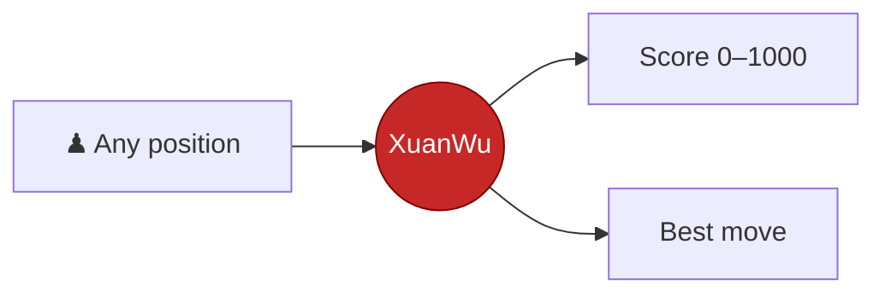
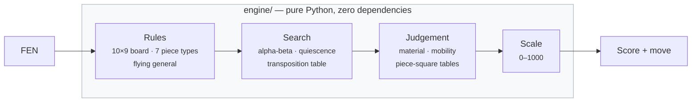
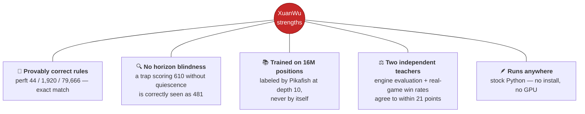
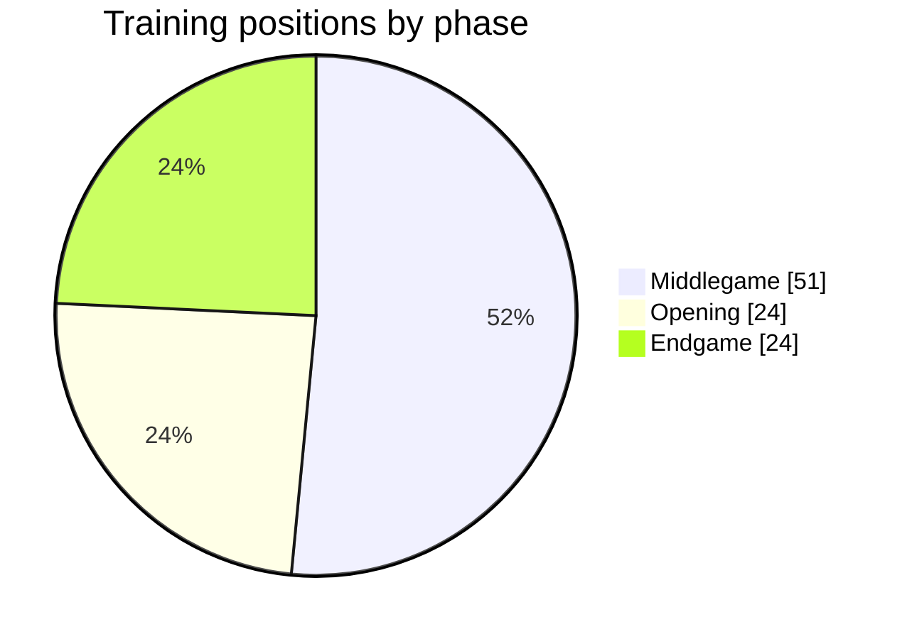
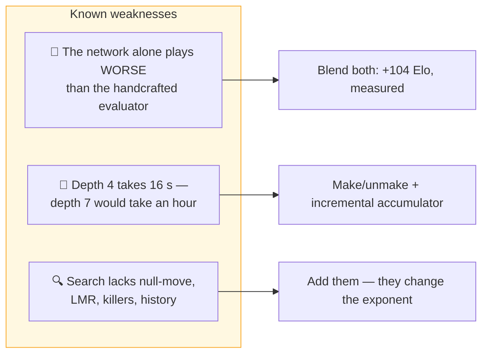
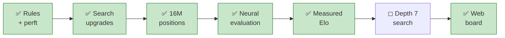

<div align="center">


# XuanWu — Xiangqi Engine v1

**玄武 · The Black Tortoise**

### A Xiangqi AI built from scratch

Named after the Black Tortoise of the four celestial guardians — a turtle entwined with a serpent.
The turtle is patience and defence; the serpent is speed and cunning. The engine plays that way:
in 24 games against Pikafish it lost once and drew twenty times.

No chess library. No borrowed engine. Every rule, every search, every evaluation — written from scratch.


</div>

---

## Table of Contents

| Section | |
|---|---|
| [In Plain English](#in-plain-english) | No chess or programming background needed |
| [What It Is](#what-it-is) | The idea in 30 seconds |
| [How It Thinks](#how-it-thinks) | Architecture at a glance |
| [Strengths](#strengths) | What it already does well |
| [Under Repair](#under-repair) | Known weaknesses being worked on |
| [What's Coming](#whats-coming) | Development roadmap |
| [Try It](#try-it) | Run it yourself |

---

## In Plain English

**What this is.** A computer program that plays Xiangqi (Chinese chess) — you make a move, it
thinks, it makes a move back. It was written from nothing: no chess engine was copied or wrapped,
every rule of the game and every line of search code was written by hand for this project.

**How it decides what to play, without the jargon.** For any given position, the program does
roughly what a strong human player does, just faster and more exhaustively: it imagines a move,
imagines how the opponent would answer, imagines the reply to that, and so on several moves deep —
then walks back up that tree of "what if" and picks the move that leads to the position it likes
best a few moves from now. "Likes best" is decided by a scorer that is part hand-written rules
(a chariot is worth more than a soldier, an active piece is worth more than a passive one) and
part a small neural network that learned patterns from 16 million positions graded by a much
stronger existing engine (Pikafish) — the network was never allowed to grade its own training
data, only to learn from an outside judge.

**How to actually use it — no setup beyond having Python installed:**

```bash
python3 web/server.py
```

This starts a local web app and opens a chessboard in your browser (nothing leaves your computer,
no account needed). From there:

- **Play** — click a piece, click where it should go, or drag it; the AI replies. A difficulty
  slider controls how long it thinks, and a hint button draws an arrow for its recommended move.
- **Solve puzzles** ("Giải thế") — tactical positions mined from the same 16 million training
  positions, so practicing doesn't cost any extra computation.
- **Review a finished game** — every move gets graded (Good / Inaccuracy / Mistake / Blunder)
  with an accuracy percentage per side, similar to a chess.com game review.
- Interface is in Vietnamese by default, with English and Chinese also available.

If you'd rather skip the web app and just ask the engine about one position from a terminal:

```bash
python3 main.py "<FEN>" --depth 2    # or omit the FEN to analyse the starting position
```

It prints a single number from 0 to 1000 (how good the position is for Red) and the move it
would play — see [What It Is](#what-it-is) below for what that number means.

## What It Is

Show XuanWu any Xiangqi position. It answers with **one number from 0 to 1000** — how good
that position is for Red — and the move it would play.



| 1000 | 505 | 500 | 0 |
|:---:|:---:|:---:|:---:|
| mate **this move** | opening position | dead level | lost |

Mate scores decay with distance, so it always takes the **shortest** mate — never just *a* mate.

## How It Thinks



Four independent layers. The scale can be recalibrated without touching judgement; judgement can
be replaced by a neural network without touching search.

## Strengths



**Balanced training diet.** Positions are drawn deliberately across all three phases, and most
carry a real material imbalance — the situations where a weak evaluator gives itself away.



## Under Repair



### What the measurements actually say

Every number below comes from games played, not from estimation.

| Evaluator | Head-to-head vs handcrafted | Verdict |
|---|---|---|
| Handcrafted (material + mobility + PST) | — | baseline |
| NNUE alone | −7 Elo at depth 1, −66 at depth 2 | **loses** |
| **Blend, 50/50** | **+104 Elo** (95% CI: +7 … +221) | **strongest** |

The network predicts Pikafish's evaluation more accurately and runs 2.6× faster than the
handcrafted function — and still plays worse on its own. What matters when picking a move is
ranking sibling positions correctly, not absolute accuracy. The handcrafted function errs
systematically, so its ordering survives; the network errs randomly, and at shallow depth that
noise exceeds the real difference between candidate moves. Averaging the two cancels part of the
noise while keeping the positional knowledge.

48 games per data point, each opening played from both sides. Confidence intervals are reported
because at this sample size a single number would overstate what is known.

## What's Coming



The web board shipped: an interactive position, a live evaluation bar, an arrow pointing at the
move XuanWu would play, a puzzle mode, and a post-game review screen — see
[In Plain English](#in-plain-english) for how to run it. Deeper search remains the open item.

## Try It

```bash
python3 web/server.py                 # play against it in your browser
python3 main.py                       # analyse the opening position from a terminal
python3 main.py "<FEN>" --depth 2     # analyse any position
python3 tests/test_engine.py          # verify the rules yourself
```

Nothing to install — the engine runs on a stock Python interpreter.
